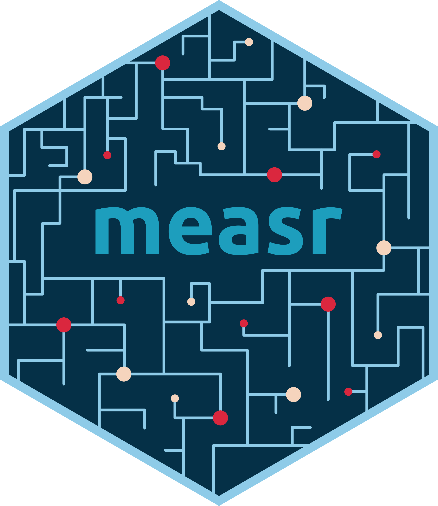

## Who am I?

```{r}
#| label: setup
#| include: false

library(tidyverse)
library(countdown)
library(ggmeasr)
library(knitr)
library(measr)
library(here)
library(ggdist)
library(magick)
library(gt)
library(gtExtras)

set_theme(plot_margin = margin(5, 0, 0, 0))

# gt theme ---------------------------------------------------------------------
gt_theme_rdcm <- function(gt_dat, bg_color = "#FFFFFF", ...) {
  gt_dat |>
    gt::opt_all_caps() |>
    gt::opt_table_font(
      font = list(gt::google_font("Open Sans"), gt::default_fonts())
    ) |>
    gt::tab_options(
      column_labels.background.color = bg_color,
      column_labels.border.top.width = gt::px(3),
      column_labels.border.top.color = bg_color,
      table.border.top.width = gt::px(1),
      table.border.bottom.width = gt::px(1),
      heading.align = "left",
      heading.background.color = bg_color,
      source_notes.padding = gt::px(10),
      source_notes.border.lr.width = gt::px(0),
      source_notes.font.size = 12,
      source_notes.background.color = bg_color,
      table.font.size = 16,
      data_row.padding = gt::px(3),
      table.background.color = bg_color,
      ...
    ) |>
    gt::tab_style(
      style = gt::cell_borders(
        sides = "bottom",
        color = "transparent",
        weight = gt::px(2)
      ),
      locations = gt::cells_body(
        columns = gt::everything(),
        rows = nrow(gt_dat$`_data`)
      )
    ) |>
    gt::tab_style(
      style = list(
        gt::cell_text(
          weight = "bold",
          align = "center",
          v_align = "middle",
          color = msr_colors[2]
        ),
        gt::cell_borders(
          sides = "bottom",
          color = msr_colors[2],
          weight = gt::px(3)
        )
      ),
      locations = gt::cells_column_labels(gt::everything())
    ) |>
    gt::tab_style(
      style = gt::cell_fill(color = bg_color),
      locations = list(gt::cells_body(
        columns = gt::everything(),
        rows = gt::everything()
      ))
    )
}
```

:::{.columns}
:::{.column width="50%"}
<br>W. Jake Thompson, Ph.D.

* Assistant Director of Psychometrics
  * [ATLAS](https://atlas.ku.edu) | University of Kansas

* Research: Applications of diagnostic psychometric models
  * Lead psychometrician and Co-PI for the [Dynamic Learnings Maps](https://dynamiclearningmaps.org) assessments
  * PI for an [IES-funded](https://ies.ed.gov/funding/grantsearch/details.asp?ID=4546) project to develop software for diagnostic models
:::

:::{.column width="50%"}
:::{.center}

```{r}
#| label: profile-picture
#| out-width: 50%
#| fig-alt: |
#|   Profile picture for Jake Thompson.


```

:::{.small}
 &nbsp; [@wjakethompson](https://www.gitub.com/wjakethompson)  
 &nbsp; [@wjakethompson.com](https://bsky.app/profile/wjakethompson.com)
:::
:::
:::
:::

# Diagnostic assessments

## Diagnostic measurement

* Designed to be multidimensional
* No continuum of student achievement
* Categorical constructs
  * Usually binary (e.g., master/nonmaster, proficient/not proficient)

* Several different names in the literature
  * Diagnostic classification models (DCMs)
  * Cognitive diagnostic models (CDMs)
  * Skills assessment models
  * Latent response models
  * Restricted latent class models

## From traditional to diagnostic assessment

:::{.columns}

:::{.column width="30%"}
* Rather than measuring a single trait, we can break the construct into a set of skills or *attributes*
:::

:::{.column width="70%"}
```{r}
#| label: dcm-attributes
#| fig-asp: 0.3
#| out-width: 80%
#| out-height: 40%
#| fig-alt: |
#|   Three circles representing the 3 attributes. The bottom half of each circle
#|   is shaded dark, and the top half is light, to indicate there are two
#|   categories for each attribute.

library(ggforce)

tibble(
  start = rep(c(-pi / 2, pi / 2), 3),
  type = rep(c("Proficient", "Non-proficient"), 3),
  skill = rep(c("Skill 1", "Skill 2", "Skill 3"), each = 2),
  x = rep(c(3, 6, 9), each = 2),
  y = 0
) |>
  ggplot() +
  geom_arc_bar(
    aes(
      x0 = x,
      y0 = y,
      r0 = 0,
      r = 1.2,
      start = start,
      end = start + pi,
      fill = type
    ),
    color = "white",
    show.legend = FALSE,
    radius = 0
  ) +
  geom_text(
    data = ~ slice(., c(1, 3, 5, 7)),
    aes(x = x, y = 0.2, label = skill),
    size = 5
  ) +
  scale_fill_manual(
    values = c(
      "Proficient" = palette_measr[3],
      "Non-proficient" = palette_measr[1]
    )
  ) +
  coord_equal() +
  theme_void()
```

:::
:::

* Attributes are categorical, often dichotomous (e.g., proficient vs. non-proficient)

# Using diagnostic models

## Utility of diagnostic results

* Attribute-level feedback about student learning is more actionable for instructional decision-making ([Thompson & Clark, 2024](https://doi.org/10.1111/emip.12619))

* However, the uniqueness and complexity of DCMs can create a "black box" for practitioners and stakeholders

## {.empty data-menu-title="measr" background-color="#023047" background-iframe="grid-worms/index.html"}

```{r}
#| label: big-image
#| out-width: 100%
#| fig-alt: "Hex logo for the measr R package."


```

## What is measr?

* R package that automates the creation of Stan scripts for DCMs

* Wraps [rstan](https://mc-stan.org/rstan) or [cmdstanr](https://mc-stan.org/cmdstanr) to estimate the models

* Provides transparency in how diagnostic results are reported
  * Probability-based score reporting
  * Comprehensive and intuitive reliability indices
  * Auditable analysis pipeline

## Data for example

* Examination for the certificate of proficiency in English (ECPE; [Templin & Hoffman, 2013](https://doi.org/10.1111/emip.12010))
  * 28 items measuring 3 total attributes
  * 2,922 respondents

* 3 attributes
  * Morphosyntactic rules
  * Cohesive rules
  * Lexical rules

## ECPE data

```{r}
#| label: ecpe-data
#| echo: true
library(dcmdata)

ecpe_data
```

## ECPE Q-matrix

```{r}
#| label: ecpe-qmatrix
#| echo: true
#| code-line-numbers: "|5|6,12|7,11"
ecpe_qmatrix
```

## Model estimation with measr

:::{.panel-tabset}
### Specification

Specify a DCM with `dcm_specify()`<br><br>

```{r}
#| label: specify-ecpe
#| echo: true

ecpe_spec <- dcm_specify(
  qmatrix = ecpe_qmatrix,
  identifier = "item_id"
)
```

### Estimation

Estimate a DCM with `dcm_estimate()`<br><br>

```{r}
#| label: estimate-ecpe
#| echo: true
#| eval: false

ecpe_lcdm <- dcm_estimate(
  dcm_spec = ecpe_spec,
  data = ecpe_data,
  identifier = "resp_id"
)
```

```{r}
#| label: estimate-ecpe-real
#| echo: false
#| eval: true

ecpe_lcdm <- dcm_estimate(
  dcm_spec = ecpe_spec,
  data = ecpe_data,
  identifier = "resp_id",
  method = "pathfinder",
  backend = "cmdstanr",
  single_path_draws = 1000,
  num_paths = 10,
  draws = 2000,
  file = here("fits", "ecpe-lcdm-uncst")
)
```

:::

# Transparent reporting with measr

## Reporing results with DCMs

:::{.columns}
:::{.column width="50%"}
* Results are typically reported as classifications on each of the assessed attributes

* No scale score or ability continuum

* Each repspondent receives a profile of mastered skills
:::

:::{.column width="50%"}
```{r}
#| label: dcm-classifications
#| echo: false

library(gt)
library(gtExtras)

ecpe_profiles <- measr_extract(ecpe_lcdm, "attribute_prob") |>
  mutate(across(c(morphosyntactic, cohesive, lexical), \(x) {
    case_when(x >= 0.5 ~ "check", x < 0.5 ~ "xmark")
  })) |>
  mutate(
    m_color = case_when(
      morphosyntactic == "xmark" ~ palette_measr[2],
      morphosyntactic == "check" ~ palette_measr[4]
    ),
    c_color = case_when(
      cohesive == "xmark" ~ palette_measr[2],
      cohesive == "check" ~ palette_measr[4]
    ),
    l_color = case_when(
      lexical == "xmark" ~ palette_measr[2],
      lexical == "check" ~ palette_measr[4]
    )
  )

ecpe_profiles |>
  slice_sample(n = 3, by = c(morphosyntactic, cohesive, lexical)) |>
  slice_sample(n = 20) |>
  select(resp_id, morphosyntactic, cohesive, lexical, ends_with("_color")) |>
  gt() |>
  cols_hide(ends_with("_color")) |>
  cols_label(resp_id = "respondent") |>
  # cols_width(img ~ px(100),
  #            everything() ~ px(150)) |>
  # gt_img_rows(columns = img, img_source = "local", height = 75) |>
  fmt_icon(
    morphosyntactic,
    fill_color = from_column("m_color"),
    height = "40px"
  ) |>
  fmt_icon(cohesive, fill_color = from_column("c_color"), height = "40px") |>
  fmt_icon(lexical, fill_color = from_column("l_color"), height = "40px") |>
  cols_align("center", -resp_id) |>
  gt_theme_measr() |>
  tab_options(
    table.font.size = 24,
    container.height = px(450),
    container.overflow.y = TRUE
  )
```

:::
:::

## Probability-based score reporting

:::{.columns}
:::{.column width="32%"}
* measr supports reporting the probability of mastery

* Can be used to communicate confidence in classifications ([Bradshaw & Levy, 2019](https://doi.org/10.1111/emip.12247))
:::

:::{.column width="5%"}
:::

:::{.column width="63%"}
```{r}
#| label: probability-scores
#| echo: true
#| code-line-numbers: "|12|14"

measr_extract(ecpe_lcdm, "attribute_prob")
```

:::
:::

# Learn more: [**r-dcm.org**](https://r-dcm.org) {.thank-you data-menu-title="Get in touch" background-color="#023047"}


:::{.columns .v-center-container}

:::{.column .image width="60%"}

:::{.center}
Slides
:::

```{r}
#| label: slides-qr-code
#| out-width: 50%
#| fig-alt: >
#|   QR code linking to https://iaea2026.wjakethompson.com
#| eval: false


```

:::

:::{.column width="40%"}

:::{.thank-you-subtitle}

:::{.small}

<br>

 \ [wjakethompson.com](https://wjakethompson.com)  
 \ [wjakethompson@ku.edu](mailto:wjakethompson@ku.edu)  
 \ [0000-0001-7339-0300](https://orcid.org/0000-0001-7339-0300)  
 \ [in/wjakethompson](https://linkedin.com/in/wjakethompson)  
 \ [@wjakethompson](https://github.com/wjakethompson)  
 \ [@wjakethompson.com](https://bsky.app/profile/wjakethompson.com)  
 \ [@wjakethompson@fosstodon.org](https://fosstodon.org/@wjakethompson)  
 \ [@wjakethompson](https://www.threads.net/@wjakethompson)  
 \ [@wjakethompson](https://twitter.com/wjakethompson)  

:::

:::

:::

:::

## Acknowledgements

The research reported here was supported by the Institute of Education Sciences, U.S. Department of Education, through Grants [R305D210045](https://ies.ed.gov/funding/grantsearch/details.asp?ID=4546) and [R305D240032](https://ies.ed.gov/funding/grantsearch/details.asp?ID=6075) to the University of Kansas Center for Research, Inc., ATLAS. The opinions expressed are those of the authors and do not represent the views of the Institute or the U.S. Department of Education.
<br><br>

:::{.columns}
:::{.column width="15%"}
:::

:::{.column width="70%"}

```{r}
#| label: ies-logo
#| out-width: 100%
#| fig-align: center
#| fig-alt: |
#|   Logo for the Institute of Education Sciences.

include_graphics("figure/IES_InstituteOfEducationSciences_RGB.png")
```

:::

:::{.column width="15%"}
:::
:::
